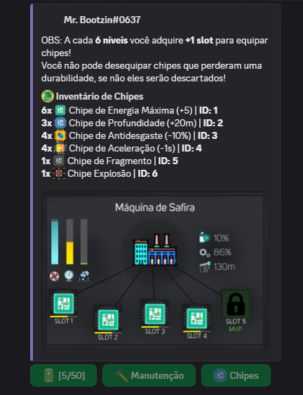
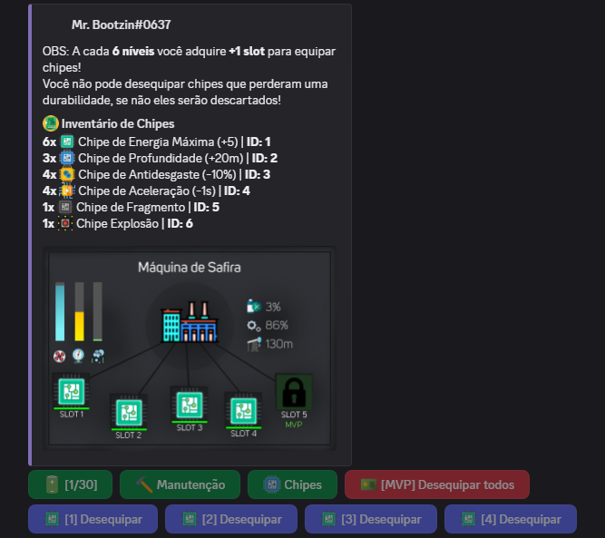
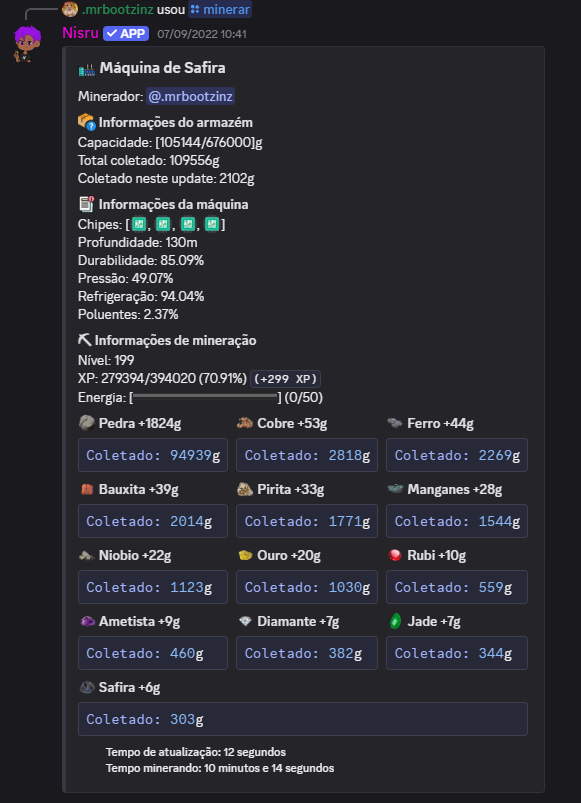
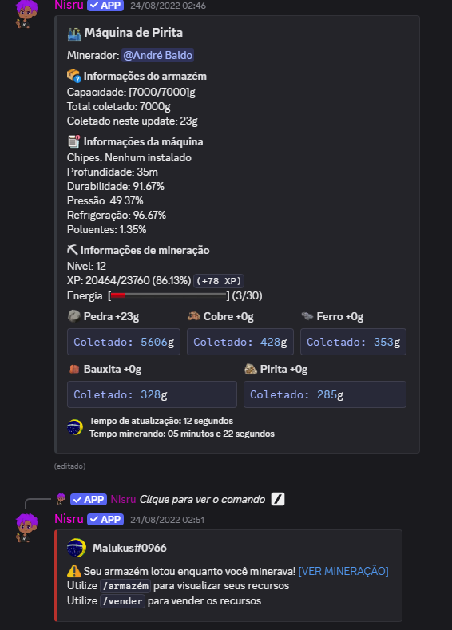
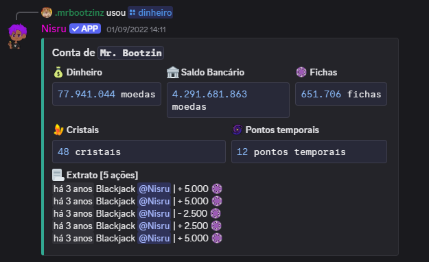
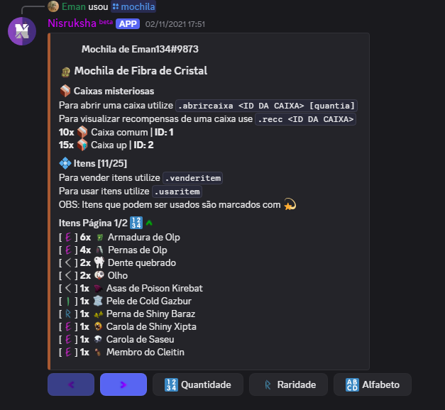
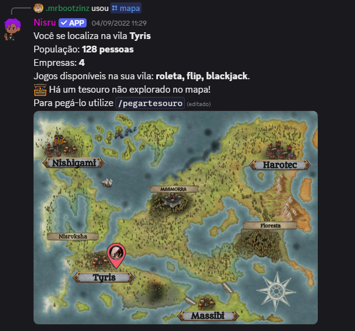
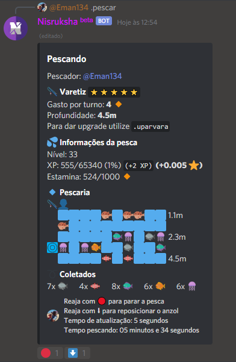
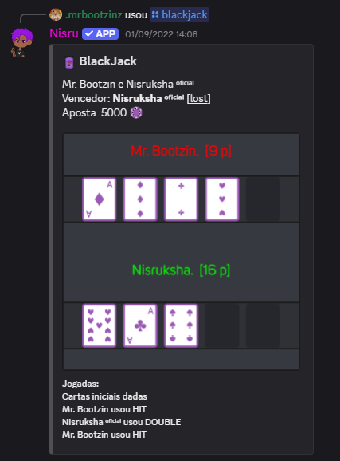

# Nisruksha
 Um bot de economia que busca entreter o seu servidor!
 - Código apenas para leitura e estudo, proibido cópias e uso pessoal/comercial.
 - Terms of Service (TOS) [CLIQUE AQUI](https://github.com/Eman134/Nisruksha-Bot/blob/master/TOS.md)
 - Privacy Policy [CLIQUE AQUI](https://github.com/Eman134/Nisruksha-Bot/blob/master/PRIVACY.md)
 - Adição para a licença: Este material é somente para estudo, é proibido o uso do mesmo para uso público em outra aplicação ou para objetivos financeiros.

Servidor oficial: https://bit.ly/svnisru

**➡** Nisruksha é um bot que lhe proporciona uma jogabilidade completa de economia, onde você pode fazer apostas, abrir empresas e dominar o ranking global.

**💭 • Sobre**

**➡** Para ficar atento sobre atualizações e anúncios, recomendamos que você entre em [**MEU SERVIDOR**]()
**➡** Caso deseja ver a história e um pequeno tutorial do bot [CLIQUE AQUI](https://eman134.github.io/nisruksha)

**📩 • Adicionar**

Para adicionar o Nisruksha ao seu servidor [**CLIQUE AQUI**](https://discord.com/oauth2/authorize?client_id=763815343507505183&scope=bot&permissions=388160)

**🌆 • Algumas imagens**

